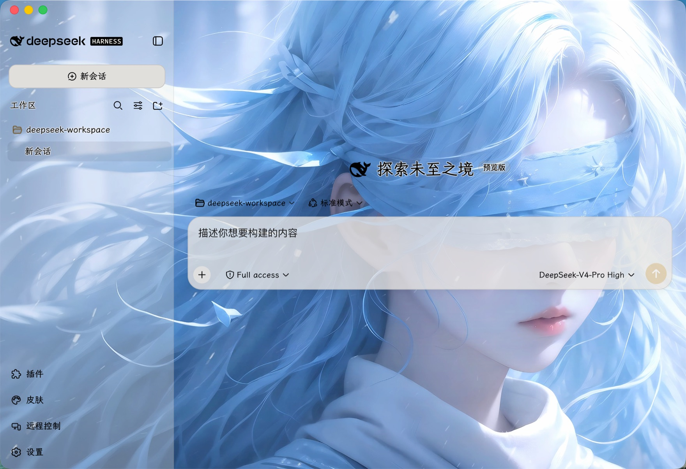
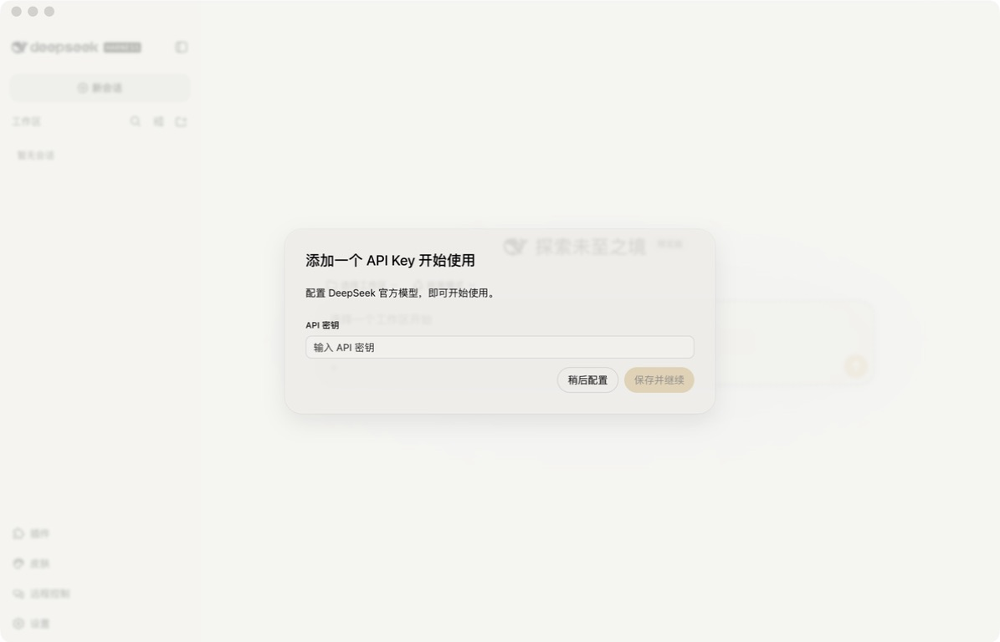
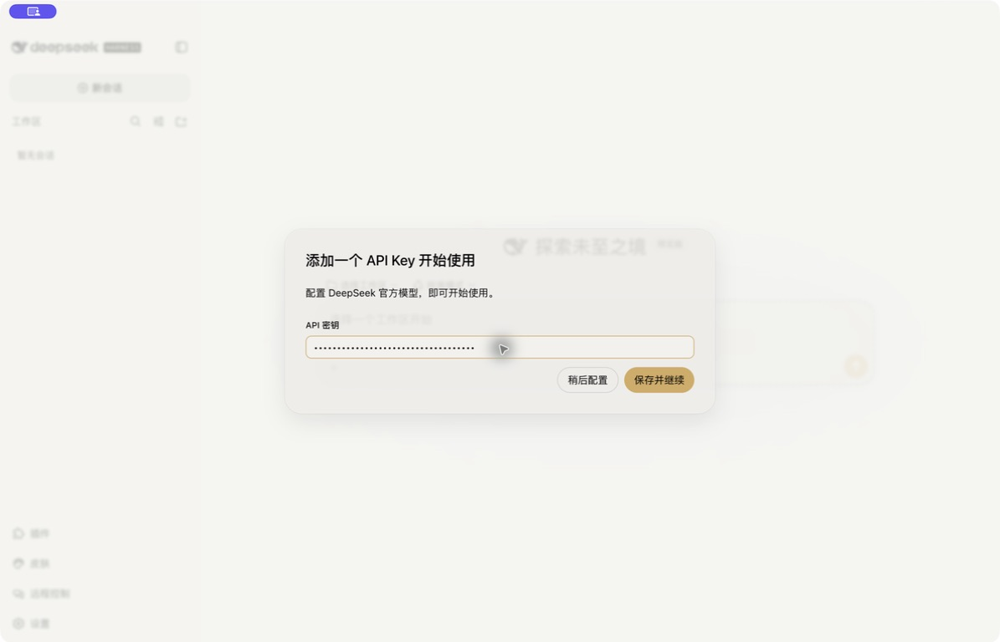
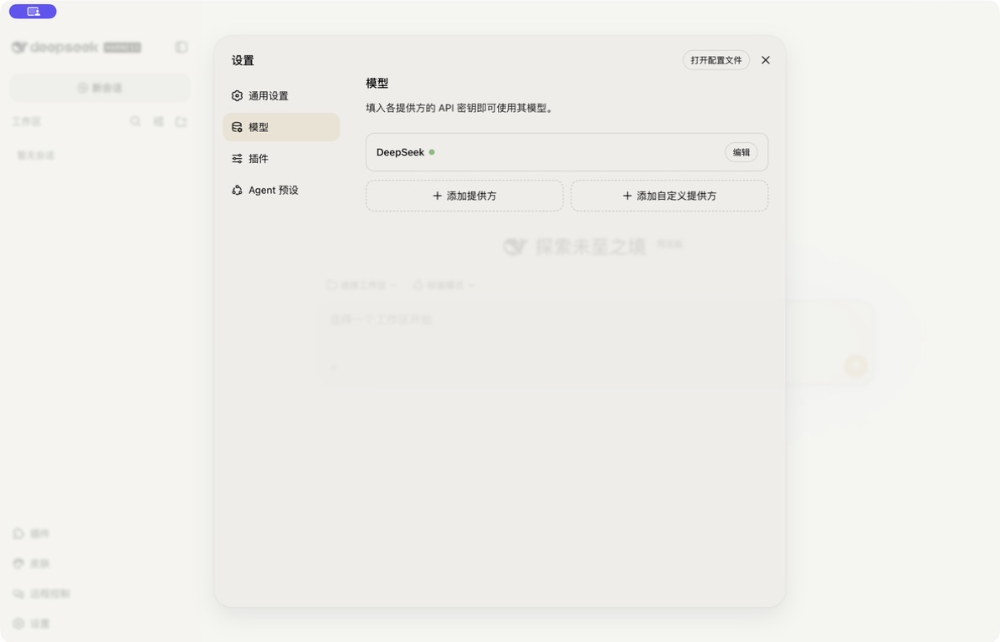
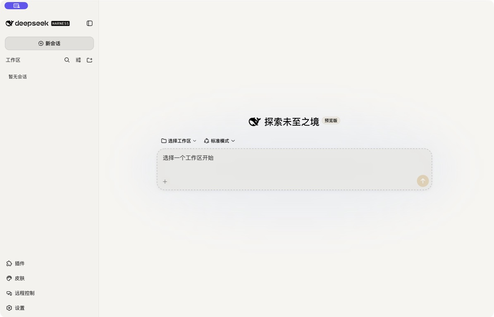

<p align="center">
  
</p>

<h1 align="center">DSH Desktop</h1>

<p align="center">
  <a href="https://github.com/deepseek-ai/deepseek-harness">DeepSeek Harness</a> 的桌面客户端。<br>
  下载即用，不用装 Node，Harness 自己会升级。
</p>

<p align="center">
  <a href="README.en.md">English</a> ·
  <a href="https://github.com/huzhicheng/dsh-desktop/releases">下载</a> ·
  <a href="docs/development.md">开发文档</a>
</p>

<p align="center">
  
</p>

---

> 社区项目，非官方发布。DeepSeek Harness 目前处于开发者预览阶段。

## 特性

- **不用装环境** —— 内置官方 Node 运行时，下载 App 就能用
- **Harness 自动升级** —— 上游发新版后应用后台更新运行时，**不用重新下载 App**；新版起不来会自动回滚并跳过坏版本
- **换肤** —— 背景图或视频、字体、配色、透明度，都在界面里调
- **插件管理** —— 在界面里安装、卸载社区插件，不用碰命令行
- **远程控制** —— 在飞书或 Telegram 里给本机的 agent 派活

支持 macOS（Apple Silicon）与 Windows 11（x64）。

## 安装

### macOS（Apple Silicon）

**第一步** 到 [Releases](https://github.com/huzhicheng/dsh-desktop/releases/latest) 下载 `DSH-Desktop-<版本>-arm64.dmg`

**第二步** 打开 dmg，把 **DSH Desktop** 拖进「应用程序」

**第三步** 打开「终端」，粘贴执行这一行：

```sh
xattr -cr "/Applications/DSH Desktop.app"
```

> [!IMPORTANT]
> 第三步不能跳过。macOS 会给所有从网上下载的文件打一个「隔离」标记，而本应用
> 没有购买 Apple 开发者证书，带着这个标记会被系统拦下、提示**「已损坏，无法打开」**。
> 它不是真的损坏，上面这行命令就是清掉那个标记。
>
> 这个提示**用右键「打开」绕不过去**，只能用这行命令。

**第四步** 双击打开。若提示「未验证的开发者」，右键点图标选「打开」，在弹窗里再点一次「打开」（只需一次，之后正常双击即可）

### Windows 11（x64）

**第一步** 到 [Releases](https://github.com/huzhicheng/dsh-desktop/releases/latest) 下载 `DSH-Desktop-Setup-<版本>.exe`

**第二步** 双击运行。SmartScreen 弹出「Windows 已保护你的电脑」时，点**「更多信息」**，再点**「仍要运行」**

**第三步** 按提示选安装目录，装完即可打开

### 装好之后

第一次启动要解压内置的 Harness，等几秒；界面出来后左下角会有**插件 / 皮肤 / 远程控制 / 设置**四个入口。

需要填一次 DeepSeek 的 API Key 才能开始对话。

## 首次配置 DeepSeek API Key

配置只需一次。API Key 会保存在本机配置中；截图和演示视频里的密钥均已隐藏。

[▶ 查看 macOS 配置演示视频（约 11 秒）](docs/media/dsh-desktop-api-key-setup-macos.mp4)

### 1. 粘贴 API Key

第一次打开时会出现「添加一个 API Key 开始使用」。把 DeepSeek API Key 粘贴到
**API 密钥**输入框；输入内容会显示为圆点，不会在界面中明文展示。

<p align="center">
  
</p>

粘贴后确认按钮变为可用，点击**保存并继续**。

<p align="center">
  
</p>

### 2. 确认配置生效

进入主界面后，打开左下角的**设置**，再点**模型**。DeepSeek 右侧出现绿色状态点，
并显示「API 密钥已配置」，说明保存成功。

<p align="center">
  
</p>

完成后会回到主界面。先选择或添加一个工作区，即可创建会话。

<p align="center">
  
</p>

以后需要更换密钥时，进入**设置 → 模型 → DeepSeek → 编辑**即可。

## 换肤

点左侧栏的**皮肤**。

- **文字** —— 字体从本机字体库里选（能列出你装的全部字体），可调文字浓度与描边
- **背景** —— 选一张图片或一段 mp4，默认完整显示、不裁边；浓度、模糊、蒙版可调
- **强度** —— 淡雅 / 适中 / 清晰三档一键切换，再用滑块微调

背景视频存在浏览器本地数据库里，不占配置体积。系统开了「降低透明度」或「减弱动态效果」时，皮肤会自动退成纯色、视频停在首帧。

## 远程控制

点左侧栏的**远程控制**，可以在飞书或 Telegram 里驱动本机的 agent。

**飞书**：点「开始扫码配置」，用飞书扫一下——应用创建、权限、事件订阅、凭据填写全自动完成，你一个字段都不用填。

**Telegram**：找 [@BotFather](https://t.me/BotFather) 发 `/newbot`，把拿到的 token 粘进去。只需这一项，走长轮询，不需要公网地址。

聊天里的用法：

- 私聊直接说话，群里 @ 机器人
- `/ls` 看工作目录，`/cd 名称` 切换，`/new` 清空上下文，`/stop` 中断，`/status` 看状态
- 需要授权的操作会发一张卡片，写明具体命令和理由，可选「允许一次」「本会话都允许」「拒绝」

> [!WARNING]
> **能给机器人发消息的人，等于能在你的电脑上执行命令。**
> 白名单是唯一的人员边界，只放你自己和确实信任的人。
> 权限默认「只读」，任何写入都要你点头。macOS 上「工作目录内可写」的越界拦截并不可靠，真要拦住请用只读。

## 已知限制

- 上游是开发者预览版，官方明确会有破坏性变更。某个新版本坏了的话，应用会自动回滚并跳过它
- 升级会重启本地服务，运行中的任务会中断
- 远程控制只传文本，发图片、语音给 agent 暂不支持；桥接进程重启后聊天上下文会丢
- 应用被强杀（`kill -9`）时可能残留 `dsh web` 进程，正常退出不会

## 开发

```sh
npm install
npm run prepare:node   # 下载官方 Node 运行时
npm run prepare:seed   # 打一个种子版 Harness
npm run dev
```

架构说明、打包发布、Windows 平台的坑都在 [docs/development.md](docs/development.md)。

## 许可

MIT。本项目与 DeepSeek 官方无关。
